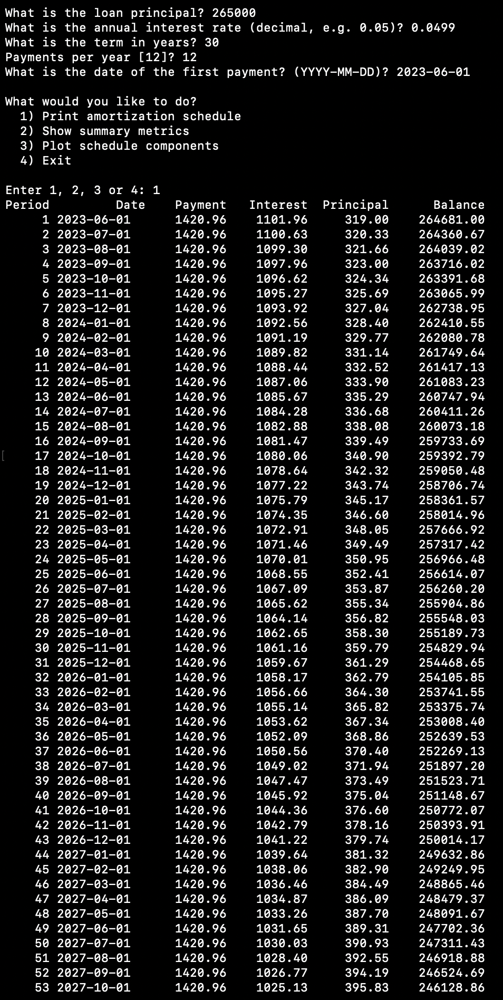
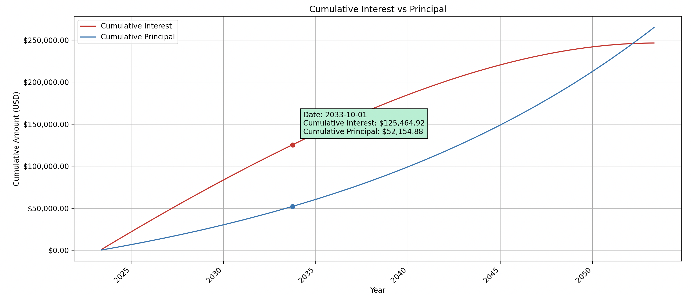
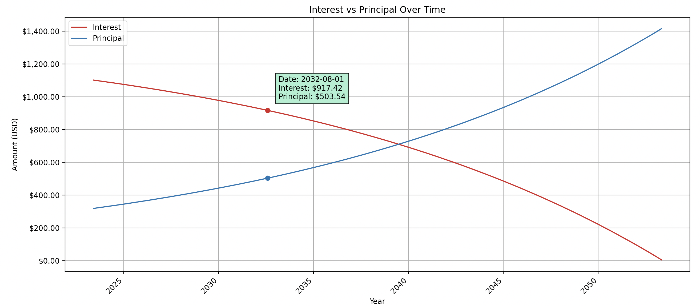

# loan_amort

**`loan_amort`** is a professional‑grade CLI and Python library for financial institutions, underwriting teams, and analysts to generate:

- Full amortization schedules (with dates)
- Summary metrics (total interest, total payments, payoff dates)
- Interactive, publication‑quality charts (balance, component breakdown, cumulative curves)

Built with accuracy, auditability, and customizability at its core.

---

## Key Features

- **Accurate Amortization**: Supports arbitrary payment frequencies (e.g. monthly, quarterly) and user‑defined first payment dates.
- **Comprehensive Metrics**: Computes total interest paid, total payment amount, payoff date, and more for quick summaries.
- **Interactive Charts**: Hoverable, snapping markers show exact dates and USD values in high‑resolution plots.
- **Flexible Output**: Print tables to stdout, save plots to PNG, or integrate into Python scripts.
- **Bank‑Ready**: Fully documented, Non‑Commercial licensed, and packaged for pip installation.

---

## Installation

```bash
pip install loan_amort
```

**Dependencies**: Python 3.7+, matplotlib, python‑dateutil, mplcursors

---

## Quickstart Examples

### 1. Amortization Schedule

```bash
$ loan_amort amortize \
    -P 265000 \
    -r 0.0499 \
    -y 30 \
    -k 12 \
    --first-date 2025-06-01
```

Produces a table with columns: Period | Date | Payment | Interest | Principal | Balance.



### 2. Cumulative Interest vs Principal

```bash
$ loan_amort plot cumulative_line \
    -P 265000 -r 0.0499 -y 30 -k 12 \
    --first-date 2025-06-01
```

Shows how principal vs interest contributions accumulate over a 30‑year term.



### 3. Interest vs Principal Components

```bash
$ loan_amort plot interest_stacked \
    -P 265000 -r 0.0499 -y 30 -k 12 \
    --first-date 2025-06-01
```

Stacked bar chart breaking down each payment into interest and principal.



---

## CLI Reference

```bash
$ loan_amort --help

Usage: loan_amort [amortize|metrics|plot|interactive] [OPTIONS]
```

- **`amortize`**: Print full schedule
- **`metrics`**: Show summary stats
- **`plot`**: Render charts (`balance_line`, `interest_line`, `interest_stacked`, `cumulative_line`)
- **`interactive`**: Wizard mode for step‑by‑step input

For detailed flags, append `--help` to any subcommand.

---

## License (Non-Commercial Use)

This software is provided under a **Non-Commercial License**. You may use, copy, modify, and distribute this software **for non-commercial purposes only**. For any commercial use, please contact the author for licensing options.

```text
Copyright (c) 2025 Oussama Ennaciri

All rights reserved. Non-commercial use only.
```
